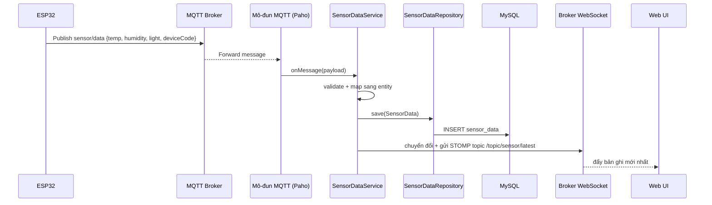
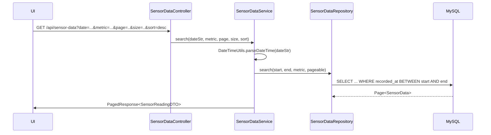
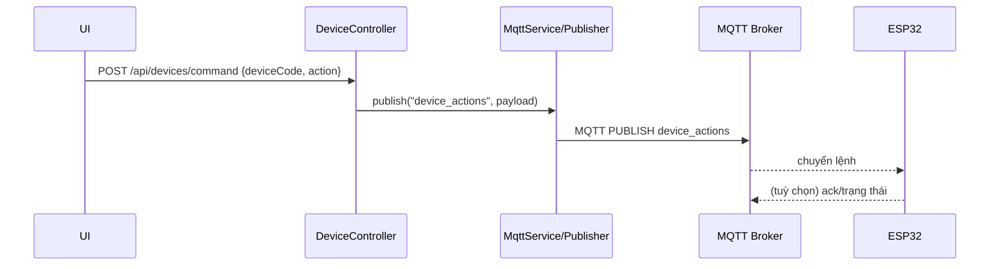

# 🧩 Kiến trúc Backend — IoT System

Tài liệu này mô tả chi tiết kiến trúc Backend (Spring Boot) của hệ thống IoT, gồm sơ đồ thành phần, các luồng xử lý runtime, mô hình dữ liệu và các điểm tích hợp. Có thể dùng trực tiếp cho báo cáo và onboarding.


## 1) Tổng quan cấp cao

```mermaid
flowchart LR
  subgraph Client[Khách hàng]
    UI[Web UI (HTML/CSS/JS)]
    STOMP[STOMP qua WebSocket]
  end

  subgraph Backend[Spring Boot]
    Controller[REST Controllers]
    WS[Broker WebSocket/STOMP]
    Service[Tầng Service]
    MQTT[Cổng MQTT (Paho)]
    Repo[Kho JPA]
    Ex[Xử lý ngoại lệ toàn cục]
    Util[Tiện ích]
  end

  subgraph Infra[Hạ tầng]
    DB[(MySQL)]
    Broker[(MQTT Broker - HiveMQ/Mosquitto)]
  end

  UI -->|HTTP/JSON| Controller
  STOMP <--> WS
  Controller --> Service
  WS --> Service
  Service --> Repo
  Repo --> DB
  MQTT <--> Broker
  MQTT --> Service
  Service --> WS
```

Vai trò chính:
- Controllers: Cung cấp HTTP endpoints cho thiết bị, dữ liệu cảm biến, lịch sử thao tác
- WebSocket: Đẩy dữ liệu real-time đến UI (SockJS + STOMP)
- MQTT: Subscribe dữ liệu cảm biến, publish lệnh điều khiển
- Services: Xử lý nghiệp vụ, validate, phân trang, map DTO
- Repositories: Lưu trữ với Spring Data JPA
- DB: MySQL lưu Devices, SensorData, DeviceActionHistory


## 2) Packages và lớp chính

- `com.iot_system.IotSystemApplication` — Điểm khởi động Spring Boot
- `config`
  - `CorsConfig` — Thiết lập CORS cho web client
  - `WebSocketConfig` — Cấu hình STOMP endpoint và simple broker
  - `MQTTConfig` — Paho client factory, options kết nối, topics
- `controller`
  - `DeviceController` — API danh sách thiết bị và gửi lệnh
  - `SensorDataController` — API dữ liệu cảm biến (mới nhất/lịch sử)
  - `DeviceActionHistoryController` — API lịch sử điều khiển
- `domain`
  - `entity`: `Device`, `SensorData`, `DeviceActionHistory`
  - `dto`: `SensorReadingDTO`, các DTO phân trang
  - `enums`: `DeviceType`, `DeviceState`, `SensorMetric`...
- `mqtt`
  - Subscriber nhận `sensor/data`
  - Publisher gửi `device_actions`
- `repository`
  - Interface Spring Data (vd. `SensorDataRepository`) có search tuỳ chỉnh
- `service`
  - Nghiệp vụ, mapping, phân trang (vd. `SensorDataService`)
- `util`
  - `DateTimeUtils`, `ResponseUtils`, v.v.
- `exception`
  - Ngoại lệ tuỳ chỉnh + global exception handler


## 3) Mô hình dữ liệu (ER)

```mermaid

  DEVICE ||--o{ SENSOR_DATA : records
  DEVICE ||--o{ DEVICE_ACTION_HISTORY : actions

  DEVICE {
    bigint id PK
    string code "mã thiết bị duy nhất"
    string name
    string type "LED/FAN/AIR..."
    string state "ON/OFF"
    datetime created_at
    datetime updated_at
  }

  SENSOR_DATA {
    bigint id PK
    double temperature
    double humidity
    double light
    datetime recorded_at
    bigint device_id FK
  }

  DEVICE_ACTION_HISTORY {
    bigint id PK
    string device_code
    string action "ON/OFF/TOGGLE..."
    string payload "tuỳ chọn"
    datetime executed_at
    string executed_by
  }
```

Ghi chú:
- `recorded_at` dùng để truy vấn theo thời gian và sắp xếp.
- Một thiết bị có thể sinh ra nhiều bản ghi `SENSOR_DATA` và lịch sử thao tác.


## 4) Luồng xử lý runtime

### 4.1 Nhận dữ liệu cảm biến qua MQTT



### 4.2 Truy vấn lịch sử cảm biến (REST)



### 4.3 Điều khiển thiết bị (REST → MQTT)




## 5) Hành vi Backend đáng chú ý

- Phân tích ngày giờ trong `SensorDataService.search`
  - Hỗ trợ nhiều định dạng: `dd-MM-yyyy HH:mm:ss`, `dd-MM-yyyy HH:mm`, `dd-MM-yyyy`, `ddMMyyyy`, `dd/MM/yyyy`, `ddMMyy`
  - Dùng `DateTimeUtils.parseDateTime` để tạo khoảng `[start, end]` theo độ chính xác giây/phút
  - Ném `InvalidDateFormatException` nếu định dạng không hợp lệ
- Phân trang & sắp xếp: Spring `PageRequest.of(page, size, Sort.by("recordedAt"))`
- Mapping DTO: `SensorReadingDTO.from(entity, index)` cho từng dòng kết quả
- Cập nhật realtime: Đẩy qua STOMP topics các bản ghi cảm biến mới nhất và trạng thái thiết bị
- Độ bền: MQTT auto-reconnect; exception handler trả JSON lỗi có cấu trúc


## 6) API tiêu biểu

- Sensor Data
  - GET `/api/sensor-data` — lịch sử phân trang, có bộ lọc ngày/metric
  - GET `/api/sensor-data/latest` — bản ghi mới nhất theo thiết bị hoặc toàn cục
- Devices
  - GET `/api/devices` — danh sách thiết bị
  - POST `/api/devices/command` — gửi lệnh; body: `{deviceCode, action}`
- History
  - GET `/api/device-history` — lịch sử thao tác phân trang


## 7) Tổng quan cấu hình

- WebSocket (STOMP)
  - Endpoint: `/ws` (bật SockJS)
  - Topics: `/topic/sensor/*`, `/topic/device/*`
- MQTT
  - Topics: `sensor/data` (inbound), `device_actions` (outbound)
  - Client: Eclipse Paho (HiveMQ Cloud hoặc Mosquitto)
- Database
  - MySQL 8.x, timezone Asia/Ho_Chi_Minh, UTF-8


## 8) Triển khai và cổng dịch vụ

- Spring Boot server: 8081 (theo README)
- Static frontend phục vụ từ `src/main/resources/static`
- Phụ thuộc ngoài: MySQL, MQTT broker


## 9) Gợi ý mở rộng

- Thêm metric cảm biến mới: mở rộng `SensorMetric`, cập nhật DTO/entity, và query repo
- Thêm loại thiết bị mới: mở rộng `DeviceType`, cập nhật UI và schema payload MQTT
- Lưu trữ lạnh: lập lịch job lưu trữ dữ liệu cũ `SENSOR_DATA` sang kho cold-storage
- Bảo mật: bổ sung Spring Security + JWT nếu triển khai internet công cộng


## 10) Xuất sơ đồ cho báo cáo

- GitHub hiển thị Mermaid trực tiếp trong Markdown
- Nếu cần ảnh tĩnh cho báo cáo, dùng VS Code Mermaid preview hoặc `mmdc` (Mermaid CLI) để xuất PNG/SVG
